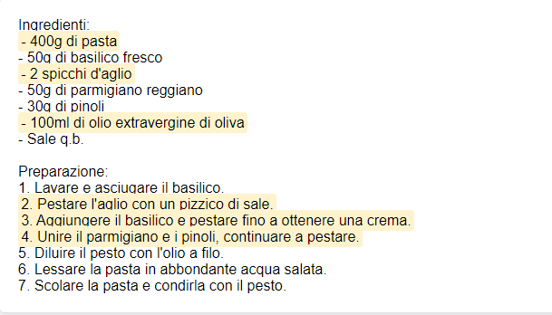

# COMPARATORE DI TESTI


### Esempio pratico
Scenario: Immagina di avere due versioni di una ricetta per la pasta al pesto.

Copia e incolla il Testo 1 ed il Testo 2 seguenti e clicca sul pulsante "Confronta".

**Testo 1:**
```
Ingredienti:
- 400g di pasta
- 50g di basilico fresco
- 2 spicchi d'aglio
- 50g di parmigiano reggiano
- 30g di pinoli
- 100ml di olio extravergine di oliva
- Sale q.b.

Preparazione:
1. Lavare e asciugare il basilico.
2. Pestare l'aglio con un pizzico di sale.
3. Aggiungere il basilico e pestare fino a ottenere una crema.
4. Unire il parmigiano e i pinoli, continuare a pestare.
5. Diluire il pesto con l'olio a filo.
6. Lessare la pasta in abbondante acqua salata.
7. Scolare la pasta e condirla con il pesto.
```

**Testo 2:**
```
Ingredienti:
- 300g di pasta
- 50g di basilico fresco
- 1 spicchio d'aglio
- 50g di parmigiano reggiano
- 30g di pinoli
- 150ml di olio extravergine di oliva
- Sale q.b.

Preparazione:
1. Lavare e asciugare il basilico.
2. Frullare l'aglio con un pizzico di sale.
3. Aggiungere il basilico e frullare fino a ottenere una crema.
4. Unire il parmigiano e i pinoli, continuare a frullare.
5. Diluire il pesto con l'olio a filo.
6. Lessare la pasta in abbondante acqua salata.
7. Scolare la pasta e condirla con il pesto.
```

**Risultato:**
Nell'area "Risultato" vedrai il Testo 1 con le differenze evidenziate in giallo.




